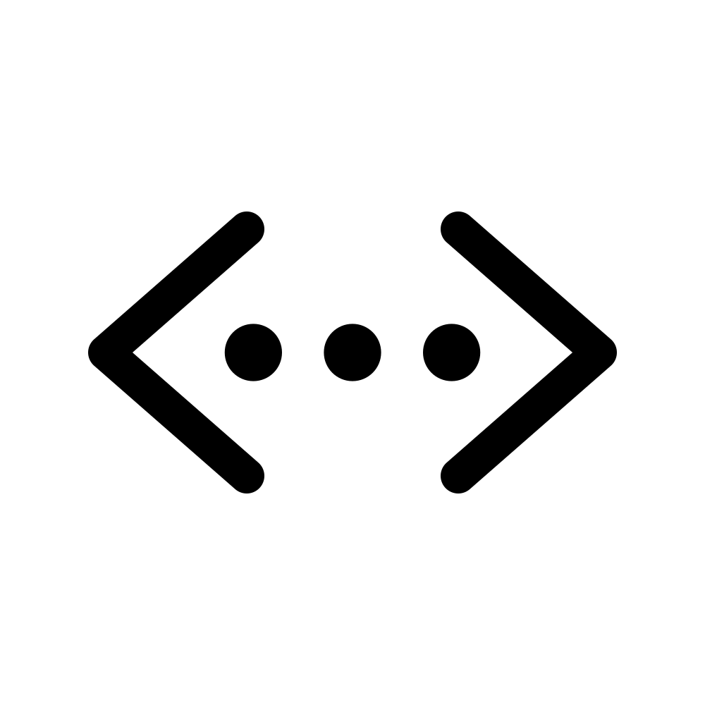

<!--
*** Basic Github Readme Boilerplate.
-->

<!-- Readme hero -->

  

<h3 align="center">Neumorphic Tic-Tac-Toe</h3>

Neumorphic tic tac toe game built with html, css & js. 
    <a href="https://lewis-elborn.github.io/js-tic-tac-toe/">Github Pages Demo</a>
    ·
    <a href="https://github.com/lewis-elborn/js-tic-tac-toe/issues">Report Bug</a>

<!-- Why did I build this? -->

## Why did I build this?

So, to cut a long story short; I came across this awesome video by [Web Dev Simplified](https://www.youtube.com/channel/UCFbNIlppjAuEX4znoulh0Cw), [linked here](https://www.youtube.com/watch?v=Y-GkMjUZsmM&ab_channel=WebDevSimplified). I thought to myself I want to try that. So here we are!

I didn't however, just want to build the same project, I wanted to give it a little bit of my own flair. I've also been wanting to try my hand at Neumorphism and this just seemed like a great little project to get stuck in.

I hope you enjoy!

<!-- License -->

## License

Distributed under the GPL-3.0 License. See `LICENSE.txt` for more information.

<!-- Contact -->

## Fancy a chat? Reach out.

Lewis Elborn - [@l_elborn](https://twitter.com/l_elborn) - lewis.elborn@aphinity.co.uk 
Project Link: [https://github.com/lewis-elborn/js-tic-tac-toe](https://github.com/lewis-elborn/js-tic-tac-toe)

Thanks for stopping by!
